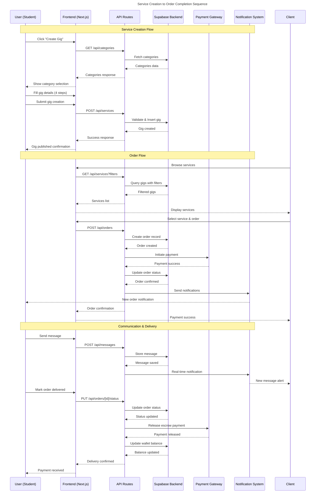
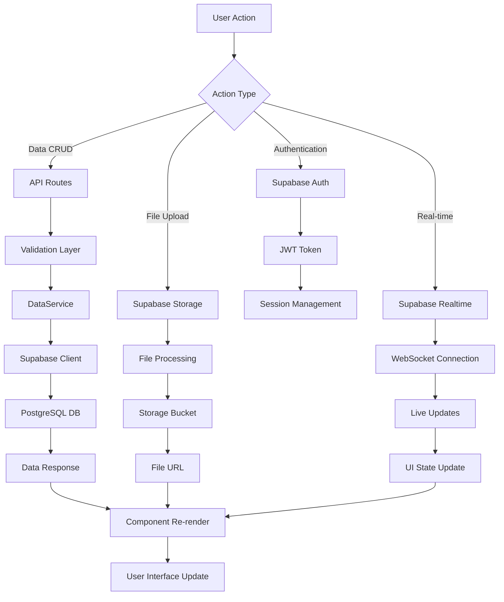
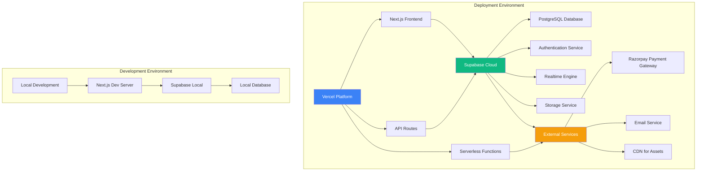
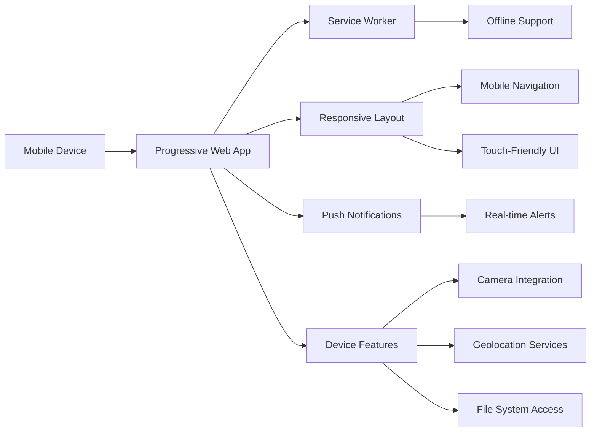
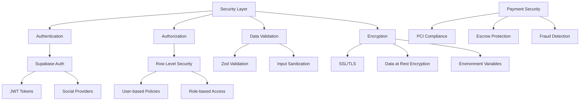
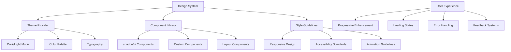
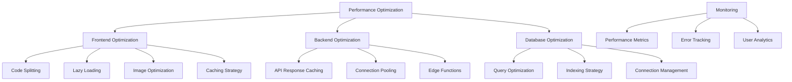
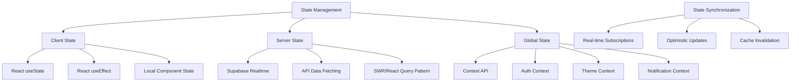

```mermaid
graph TB
    subgraph "Frontend Layer (Next.js)"
        A[App Router] --> B[Layout.tsx]
        B --> C[Navigation Component]
        B --> D[MobileNav Component]
        B --> E[ChatbotWidget]
        
        F[Pages] --> G[HomePage]
        F --> H[GigsPage]
        F --> I[DashboardPage]
        F --> J[MessagesPage]
        F --> K[ProfilePage]
        
        L[UI Components] --> M[shadcn/ui Components]
        L --> N[Custom Components]
        N --> O[GigCard]
        N --> P[CategoryCard]
        N --> Q[ReviewCard]
    end
    
    subgraph "API Layer (Next.js API Routes)"
        R[Services API] --> S[GET /api/services]
        R --> T[POST /api/services]
        U[Orders API] --> V[POST /api/orders]
        U --> W[PUT /api/orders/:id]
        X[Messages API] --> Y[GET /api/messages]
        X --> Z[POST /api/messages]
        AA[Payments API] --> BB[POST /api/payments]
        AA --> CC[Webhook Handler]
    end
    
    subgraph "Service Layer"
        DD[DataService] --> EE[User Management]
        DD --> FF[Gig Management]
        DD --> GG[Order Processing]
        DD --> HH[Messaging Service]
        II[PaymentService] --> JJ[Razorpay Integration]
        II --> KK[Escrow Management]
        LL[NotificationService] --> MM[Real-time Updates]
        LL --> NN[Email Notifications]
    end
    
    subgraph "Backend Layer (Supabase)"
        OO[PostgreSQL Database] --> PP[Users Table]
        OO --> QQ[Gigs Table]
        OO --> RR[Orders Table]
        OO --> SS[Messages Table]
        OO --> TT[Reviews Table]
        UU[Authentication] --> VV[JWT Auth]
        UU --> WW[Social Auth]
        XX[Realtime Engine] --> YY[Live Messaging]
        XX --> ZZ[Live Notifications]
        AAA[Storage] --> BBB[File Uploads]
        AAA --> CCC[Media Files]
    end
    
    A --> R
    F --> R
    R --> DD
    DD --> OO
    DD --> UU
    DD --> AAA
    DD --> II
    DD --> LL
```

# Student Market - Architecture Diagrams

## System Overview
Student Market is a full-stack web application built with Next.js 15, React 19, and Supabase, designed as a marketplace for students in Pune, India to offer and find various services.

---

## 🎯 Activity Diagram - User Journey Flow

```mermaid
activityDiagram
    title Student Market - User Activity Flow
    
    start
    :User Visits Platform;
    
    partition Authentication {
        :Browse Services (Guest);
        --> Sign Up/Sign In;
        :User Authentication;
        note right: Supabase Auth
    }
    
    partition Role Selection {
        :Select Role (Student/Client/Officer);
        --> Complete Onboarding;
        :Profile Setup;
        note right: Profile data stored in Supabase
    }
    
    partition Main Flow {
        if (Role is Student?) then (yes)
            :Create Gig/Service;
            note right: 4-step wizard process
            --> Set Pricing & Delivery;
            --> Upload Media;
            --> Publish Service;
            --> Manage Bids;
            --> Communicate with Clients;
            --> Deliver Work;
            --> Receive Payment;
        else (no)
            if (Role is Client?) then (yes)
                :Browse/Search Services;
                --> Filter by Category/Price;
                --> View Service Details;
                --> Place Order/Submit Bid;
                --> Make Payment (Escrow);
                --> Communicate with Student;
                --> Receive Delivery;
                --> Review & Rate Service;
            else (no)
                :Access Analytics Dashboard;
                --> Monitor Platform Metrics;
                --> Manage Users;
                --> View Reports;
            endif
        endif
    }
    
    partition Common Features {
        :Real-time Messaging;
        :Notifications Management;
        :Profile Management;
        :Wallet & Payment History;
        :Reviews & Ratings;
    }
    
    stop
```

---

## 🔄 Sequence Diagram - Service Creation & Order Flow



---

## 🏗️ Class Diagram - System Architecture

```mermaid
classDiagram
    title Student Market - Class Architecture
    
    namespace Frontend.Components {
        class Navigation {
            +user: User
            +searchQuery: string
            +unreadCount: number
            +handleSignOut()
            +handleSearch()
            +fetchUserProfile()
        }
        
        class GigCard {
            +gig: Gig
            +onViewDetails()
            +onContactSeller()
            +renderRating()
        }
        
        class ChatbotWidget {
            +position: string
            +isOpen: boolean
            +toggleChat()
            +sendMessage()
            +handleResponse()
        }
        
        class MobileNav {
            +user: User
            +unreadCount: number
            +renderNavItems()
        }
    }
    
    namespace Frontend.Pages {
        class HomePage {
            +categories: Category[]
            +featuredGigs: Gig[]
            +testimonials: Testimonial[]
            +renderHeroSection()
            +renderCategories()
            +renderFeaturedServices()
        }
        
        class GigsPage {
            +gigs: Gig[]
            +filters: GigFilters
            +loading: boolean
            +fetchGigs()
            +handleSearch()
            +applyFilters()
        }
        
        class DashboardPage {
            +user: User
            +myGigs: Gig[]
            +orders: Order[]
            +analytics: Analytics
            +loadDashboard()
            +createNewGig()
            +manageOrders()
        }
    }
    
    namespace API.Routes {
        class ServicesAPI {
            +GET(req: Request)
            +POST(req: Request)
            +validateServiceData()
            +handleFilters()
        }
        
        class OrdersAPI {
            +GET(req: Request)
            +POST(req: Request)
            +PUT(req: Request)
            +updateOrderStatus()
            +processPayment()
        }
        
        class MessagesAPI {
            +GET(req: Request)
            +POST(req: Request)
            +markAsRead()
            +getConversation()
        }
        
        class PaymentsAPI {
            +createPayment()
            +handleWebhook()
            +verifyPayment()
            +releaseEscrow()
        }
    }
    
    namespace Database.Models {
        class User {
            +id: UUID
            +email: string
            +full_name: string
            +avatar_url: string
            +college: string
            +major: string
            +year: number
            +bio: string
            +skills: string[]
            +reputation_score: number
            +wallet_balance: number
            +is_verified: boolean
            +role: UserRole
            +onboarding_completed: boolean
            +created_at: Timestamp
            +updated_at: Timestamp
        }
        
        class Gig {
            +id: UUID
            +user_id: UUID
            +title: string
            +description: string
            +category_id: UUID
            +price: number
            +delivery_days: number
            +tags: string[]
            +images: string[]
            +video_url: string
            +is_active: boolean
            +rating: number
            +total_orders: number
            +created_at: Timestamp
            +updated_at: Timestamp
        }
        
        class Order {
            +id: UUID
            +gig_id: UUID
            +buyer_id: UUID
            +seller_id: UUID
            +status: OrderStatus
            +amount: number
            +requirements: string
            +delivery_date: Timestamp
            +completed_at: Timestamp
            +created_at: Timestamp
        }
        
        class Message {
            +id: UUID
            +sender_id: UUID
            +receiver_id: UUID
            +order_id: UUID
            +content: string
            +attachments: string[]
            +is_read: boolean
            +created_at: Timestamp
        }
        
        class Review {
            +id: UUID
            +order_id: UUID
            +reviewer_id: UUID
            +rating: number
            +comment: string
            +created_at: Timestamp
        }
        
        class Category {
            +id: UUID
            +name: string
            +description: string
            +icon: string
            +color: string
            +created_at: Timestamp
        }
    }
    
    namespace Services {
        class DataService {
            +getCurrentUser()
            +getGigs(filters)
            +createGig(data)
            +createOrder(data)
            +sendMessage(data)
            +getMessages(userId)
            +updateProfile(data)
            +processPayment(data)
        }
        
        class SupabaseClient {
            +auth: Auth
            +from(table): QueryBuilder
            +storage: Storage
            +realtime: RealtimeClient
            +functions: Functions
        }
        
        class PaymentService {
            +createOrder(amount, currency)
            +verifyPayment(paymentId)
            +releaseEscrow(orderId)
            +refundPayment(orderId)
        }
        
        class NotificationService {
            +sendPushNotification(userId, message)
            +sendEmailNotification(userEmail, template)
            +subscribeToRealtimeUpdates(userId)
            +markAsRead(notificationId)
        }
    }
    
    %% Relationships
    User ||--o{ Gig : creates
    User ||--o{ Order : places/buys
    User ||--o{ Message : sends
    User ||--o{ Review : writes
    Gig ||--o{ Order : generates
    Order ||--|| Message : contains
    Order ||--|| Review : receives
    Gig }|--|| Category : belongs_to
    
    Navigation --> User : uses
    GigCard --> Gig : displays
    HomePage --> GigCard : renders
    GigsPage --> GigCard : renders
    DashboardPage --> User : manages
    
    ServicesAPI --> DataService : calls
    OrdersAPI --> DataService : calls
    MessagesAPI --> DataService : calls
    PaymentsAPI --> PaymentService : uses
    
    DataService --> SupabaseClient : queries
    DataService --> PaymentService : processes
    DataService --> NotificationService : notifies
    
    User "1" -- "*" Gig : creates
    User "1" -- "*" Order : participates
    Gig "1" -- "*" Order : generates
    Order "1" -- "*" Message : contains
```

---

## 🔧 Component Architecture Diagram



---

## 📊 Data Flow Architecture



---

## 🚀 Deployment Architecture



---

## 📱 Mobile-First Architecture



---

## 🔒 Security Architecture



---

## 🎨 UI/UX Architecture



---

## 📈 Performance Architecture



---

## 🔄 State Management Architecture



---

## 🎯 Key Architectural Features

### 1. **Microservices Pattern**
- Separation of concerns between frontend, API, and backend services
- Modular API routes for different functionalities
- Service layer for business logic abstraction

### 2. **Real-time Architecture**
- WebSocket connections via Supabase Realtime
- Live messaging and notifications
- Optimistic UI updates

### 3. **Security-First Design**
- Row-level security in database
- JWT-based authentication
- Input validation and sanitization

### 4. **Mobile-First Progressive Web App**
- Responsive design with Tailwind CSS
- Service worker for offline functionality
- Touch-optimized interfaces

### 5. **Scalable Database Design**
- Normalized PostgreSQL schema
- Efficient indexing strategy
- Relationship integrity

### 6. **Payment Integration**
- Escrow-based payment system
- Multiple payment methods
- Secure transaction handling

---

## 📋 Technology Stack Summary

| Layer | Technology | Purpose |
|-------|------------|---------|
| **Frontend** | Next.js 15, React 19 | Full-stack framework |
| **Styling** | Tailwind CSS, shadcn/ui | Utility-first styling |
| **Backend** | Supabase | BaaS (Database, Auth, Realtime) |
| **Database** | PostgreSQL | Relational data storage |
| **Authentication** | Supabase Auth | User management |
| **Payments** | Razorpay | Payment processing |
| **Real-time** | Supabase Realtime | Live updates |
| **Storage** | Supabase Storage | File uploads |
| **Deployment** | Vercel | Hosting platform |

---

## 🔍 Design Patterns Used

1. **Repository Pattern**: Data service abstraction
2. **Observer Pattern**: Real-time subscriptions
3. **Factory Pattern**: Component creation
4. **Strategy Pattern**: Payment processing
5. **Singleton Pattern**: Service instances
6. **Decorator Pattern**: HOCs and middleware
7. **Command Pattern**: API route handlers

---

This architecture provides a robust, scalable, and maintainable foundation for the Student Market platform, following modern web development best practices and design patterns.
