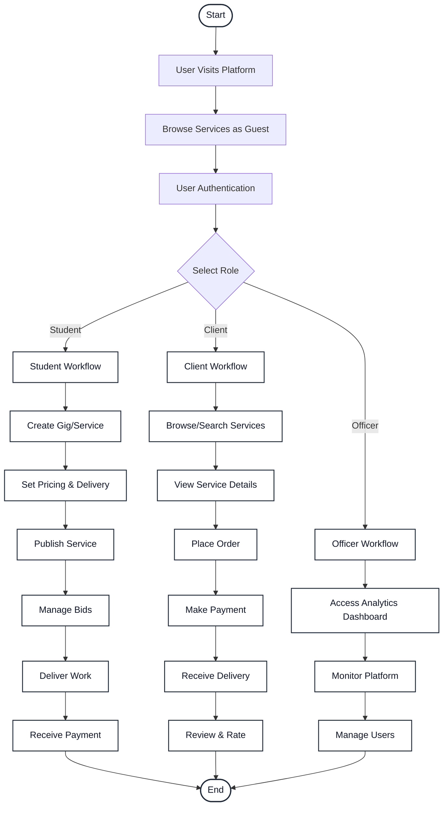
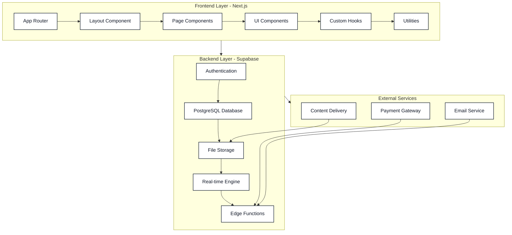
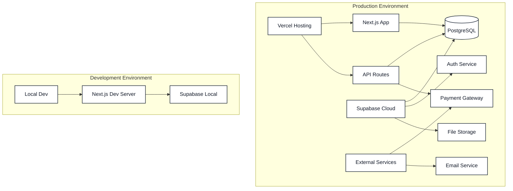
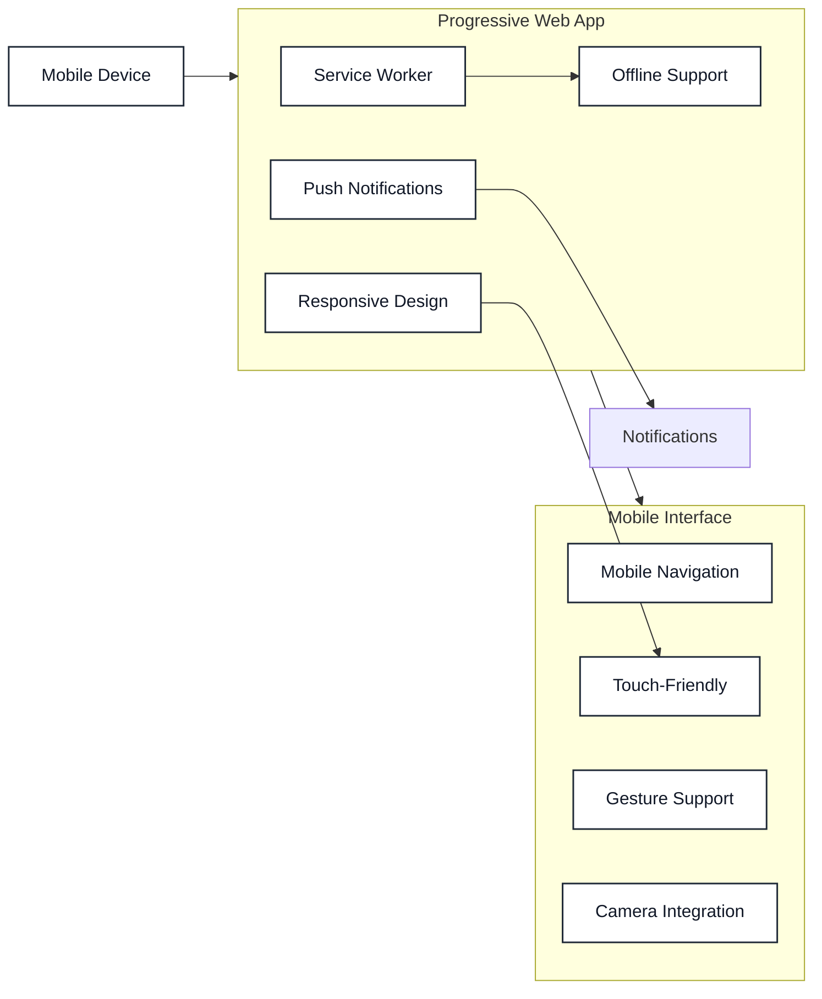
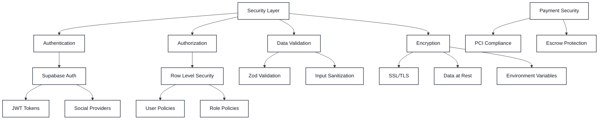

# Student Market - Architecture Diagrams

## System Overview
Student Market is a full-stack web application built with Next.js 15, React 19, and Supabase, designed as a marketplace for students in Pune, India to offer and find various services.

---

## 📊 Activity Diagram - User Journey Flow

---

## 🔄 Sequence Diagram - Service Creation & Order Flow

---

## 🏗️ Class Diagram - System Architecture

---

## 🔧 Component Architecture Diagram

---

## 📊 Data Flow Architecture

---

## 🚀 Deployment Architecture

---

## 📱 Mobile-First Architecture

---

## 🔒 Security Architecture

---

## 🎨 UI/UX Architecture

```mermaid
%%{init: { 'theme': 'base', 'themeVariables': { 'background': '#ffffff', 'primaryColor': '#ffffff', 'secondaryColor': '#ffffff', 'tertiaryColor': '#ffffff', 'primaryTextColor': '#111827', 'textColor': '#111827', 'titleColor': '#111827', 'lineColor': '#1f2937', 'primaryBorderColor': '#1f2937', 'defaultLinkColor': '#1f2937', 'edgeLabelBackground': '#ffffff', 'arrowheadColor': '#1f2937', 'clusterBkg': '#ffffff', 'clusterBorder': '#1f2937', 'fontFamily': 'Inter, ui-sans-serif, system-ui, -apple-system, Segoe UI, Roboto, Helvetica, Arial, "Apple Color Emoji", "Segoe UI Emoji"', 'fontSize': '14px' }, 'flowchart': { 'nodeSpacing': 40, 'rankSpacing': 60, 'padding': 12 } }}%%
graph TB
    DesignSystem[Design System] --> Theme[Theme Provider]
    DesignSystem --> Components[Component Library]
    DesignSystem --> Guidelines[Style Guidelines]
    
    Theme --> DarkMode[Dark/Light Mode]
    Theme --> Colors[Color Palette]
    Theme --> Typography[Typography System]
    
    Components --> Shadcn[shadcn/ui]
    Components --> Custom[Custom Components]
    Components --> Layout[Layout Components]
    
    Guidelines --> Responsive[Responsive Design]
    Guidelines --> Accessibility[Accessibility WCAG]
    Guidelines --> Animations[Animation Guidelines]
    
    UX[User Experience] --> Loading[Loading States]
    UX --> Errors[Error Handling]
    UX --> Feedback[Feedback Systems]
    
    classDef designBox fill:#ffffff,stroke:#1f2937,stroke-width:1.5px,color:#111827
    classDef themeBox fill:#ffffff,stroke:#1f2937,stroke-width:1.5px,color:#111827
    classDef uxBox fill:#ffffff,stroke:#1f2937,stroke-width:1.5px,color:#111827
    
    class DesignSystem designBox
    class Theme,DarkMode,Colors,Typography themeBox
    class Components,Shadcn,Custom,Layout,Guidelines,Responsive,Accessibility,Animations,UX,Loading,Errors,Feedback uxBox
```

---

## 📈 Performance Architecture

```mermaid
%%{init: { 'theme': 'base', 'themeVariables': { 'background': '#ffffff', 'primaryColor': '#ffffff', 'secondaryColor': '#ffffff', 'tertiaryColor': '#ffffff', 'primaryTextColor': '#111827', 'textColor': '#111827', 'titleColor': '#111827', 'lineColor': '#1f2937', 'primaryBorderColor': '#1f2937', 'defaultLinkColor': '#1f2937', 'edgeLabelBackground': '#ffffff', 'arrowheadColor': '#1f2937', 'clusterBkg': '#ffffff', 'clusterBorder': '#1f2937', 'fontFamily': 'Inter, ui-sans-serif, system-ui, -apple-system, Segoe UI, Roboto, Helvetica, Arial, "Apple Color Emoji", "Segoe UI Emoji"', 'fontSize': '14px' }, 'flowchart': { 'nodeSpacing': 40, 'rankSpacing': 60, 'padding': 12 } }}%%
graph TB
    Performance[Performance Optimization] --> Frontend[Frontend Optimization]
    Performance --> Backend[Backend Optimization]
    Performance --> Database[Database Optimization]
    
    Frontend --> CodeSplit[Code Splitting]
    Frontend --> LazyLoad[Lazy Loading]
    Frontend --> Images[Image Optimization]
    Frontend --> Cache[Browser Caching]
    
    Backend --> API[API Caching]
    Backend --> Connection[Connection Pooling]
    Backend --> Edge[Edge Functions]
    
    Database --> Queries[Query Optimization]
    Database --> Indexes[Database Indexing]
    Database --> Connections[Connection Management]
    
    Monitoring[Performance Monitoring] --> Metrics[Core Web Vitals]
    Monitoring --> Tracking[Error Tracking]
    Monitoring --> Analytics[User Analytics]
    
    classDef perfBox fill:#ffffff,stroke:#1f2937,stroke-width:1.5px,color:#111827
    classDef frontendBox fill:#ffffff,stroke:#1f2937,stroke-width:1.5px,color:#111827
    classDef backendBox fill:#ffffff,stroke:#1f2937,stroke-width:1.5px,color:#111827
    classDef monitorBox fill:#ffffff,stroke:#1f2937,stroke-width:1.5px,color:#111827
    
    class Performance perfBox
    class Frontend,CodeSplit,LazyLoad,Images,Cache frontendBox
    class Backend,API,Connection,Edge,Database,Queries,Indexes,Connections backendBox
    class Monitoring,Metrics,Tracking,Analytics monitorBox
```

---

## 🔄 State Management Architecture

```mermaid
%%{init: { 'theme': 'base', 'themeVariables': { 'background': '#ffffff', 'primaryColor': '#ffffff', 'secondaryColor': '#ffffff', 'tertiaryColor': '#ffffff', 'primaryTextColor': '#111827', 'textColor': '#111827', 'titleColor': '#111827', 'lineColor': '#1f2937', 'primaryBorderColor': '#1f2937', 'defaultLinkColor': '#1f2937', 'edgeLabelBackground': '#ffffff', 'arrowheadColor': '#1f2937', 'clusterBkg': '#ffffff', 'clusterBorder': '#1f2937', 'fontFamily': 'Inter, ui-sans-serif, system-ui, -apple-system, Segoe UI, Roboto, Helvetica, Arial, "Apple Color Emoji", "Segoe UI Emoji"', 'fontSize': '14px' }, 'flowchart': { 'nodeSpacing': 40, 'rankSpacing': 60, 'padding': 12 } }}%%
graph TB
    State[State Management] --> Client[Client State]
    State --> Server[Server State]
    State --> Global[Global State]
    
    Client --> Local[Component State]
    Client --> Forms[Form State]
    Client --> UI[UI State]
    
    Server --> Supabase[Supabase Client]
    Server --> API[API State]
    Server --> Cache[Query Cache]
    
    Global --> Auth[Authentication]
    Global --> User[User Profile]
    Global --> Theme[Theme Settings]
    
    Realtime[Real-time Updates] --> Subscriptions[WebSocket Subscriptions]
    Realtime --> Sync[State Synchronization]
    
    classDef stateBox fill:#ffffff,stroke:#1f2937,stroke-width:1.5px,color:#111827
    classDef clientBox fill:#ffffff,stroke:#1f2937,stroke-width:1.5px,color:#111827
    classDef serverBox fill:#ffffff,stroke:#1f2937,stroke-width:1.5px,color:#111827
    classDef realtimeBox fill:#ffffff,stroke:#1f2937,stroke-width:1.5px,color:#111827
    
    class State stateBox
    class Client,Local,Forms,UI clientBox
    class Server,Supabase,API,Cache serverBox
    class Global,Auth,User,Theme,Realtime,Subscriptions,Sync realtimeBox
```

---

## 🎯 Key Architectural Features

### 1. **Microservices Pattern**
- Separation of concerns between frontend, API, and backend services
- Modular API routes for different functionalities
- Service layer for business logic abstraction

### 2. **Real-time Architecture**
- WebSocket connections via Supabase Realtime
- Live messaging and notifications
- Optimistic UI updates

### 3. **Security-First Design**
- Row-level security in database
- JWT-based authentication
- Input validation and sanitization

### 4. **Mobile-First Progressive Web App**
- Responsive design with Tailwind CSS
- Service worker for offline functionality
- Touch-optimized interfaces

### 5. **Scalable Database Design**
- Normalized PostgreSQL schema
- Efficient indexing strategy
- Relationship integrity

### 6. **Payment Integration**
- Escrow-based payment system
- Multiple payment methods
- Secure transaction handling

---

## 📋 Technology Stack Summary

| Layer | Technology | Purpose |
|-------|------------|---------|
| **Frontend** | Next.js 15, React 19 | Full-stack framework |
| **Styling** | Tailwind CSS, shadcn/ui | Utility-first styling |
| **Backend** | Supabase | BaaS (Database, Auth, Realtime) |
| **Database** | PostgreSQL | Relational data storage |
| **Authentication** | Supabase Auth | User management |
| **Payments** | Razorpay | Payment processing |
| **Real-time** | Supabase Realtime | Live updates |
| **Storage** | Supabase Storage | File uploads |
| **Deployment** | Vercel | Hosting platform |

---

## 🔍 Design Patterns Used

1. **Repository Pattern**: Data service abstraction
2. **Observer Pattern**: Real-time subscriptions
3. **Factory Pattern**: Component creation
4. **Strategy Pattern**: Payment processing
5. **Singleton Pattern**: Service instances
6. **Decorator Pattern**: HOCs and middleware
7. **Command Pattern**: API route handlers

---

This architecture provides a robust, scalable, and maintainable foundation for the Student Market platform, following modern web development best practices and design patterns.
