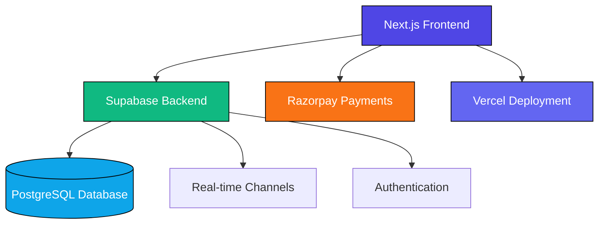
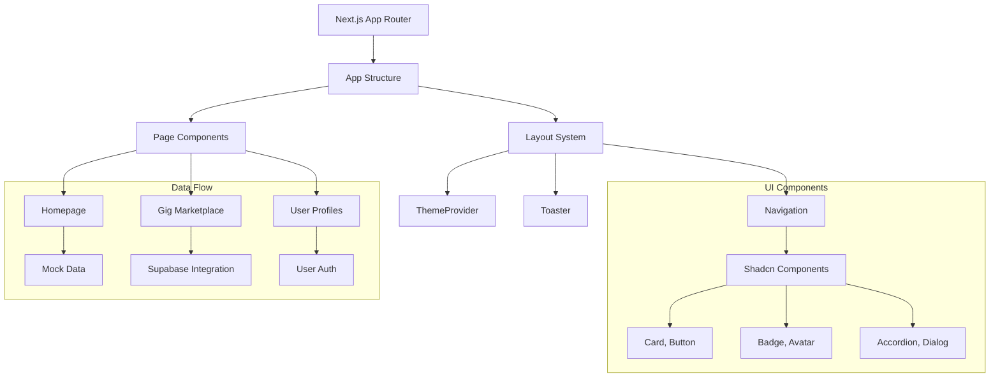

# 🎓 Student Marketplace - Enhanced Project Documentation

<p align="center">
  
  
  
  
</p>

## 📋 Table of Contents
- [Project Overview](#project-overview)
- [Technology Stack](#technology-stack)
- [Architecture Overview](#architecture-overview)
- [Core Features](#core-features)
- [System Design](#system-design)
- [Development Workflow](#development-workflow)
- [Deployment](#deployment)
- [Project Structure](#project-structure)
- [Conclusion](#conclusion)

---

## 🎯 Project Overview

**Student Marketplace** is a revolutionary peer-to-peer platform designed specifically for students in Pune, India, to connect, collaborate, and monetize their academic skills. This Next.js-based marketplace enables students to offer services, find peer experts, and access job opportunities within their local university ecosystem.

### 🎨 Key Value Propositions
- **🎓 Academic Focus**: Tailored for student needs in Pune's educational landscape
- **💰 Monetization**: Students can earn through services and jobs
- **🤝 Peer Network**: Connect with fellow students from local universities
- **🚀 Skill Development**: Opportunities to enhance technical and soft skills

### 🎯 Project Goals
- **Inclusive Access**: Democratize access to academic services
- **Local Community**: Foster collaboration within Pune's student community
- **Professional Growth**: Bridge gap between academics and industry
- **Economic Empowerment**: Enable students to monetize their skills

---

## ⚙️ Technology Stack

### Frontend
| Technology | Purpose | Version |
|------------|---------|---------|
| **Next.js** | Framework | v15.5.4 |
| **TypeScript** | Language | Latest |
| **React** | UI Library | v19 |
| **Tailwind CSS** | Styling | Latest |
| **shadcn/ui** | Components | Latest |
| **Framer Motion** | Animations | Latest |
| **Lucide React** | Icons | Latest |

### Backend & Services
| Technology | Purpose | Provider |
|------------|---------|----------|
| **Supabase** | Backend | PostgreSQL DB, Auth, Real-time |
| **Razorpay** | Payments | Indian Payment Gateway |
| **Vercel** | Deployment | Hosting & CI/CD |

### Development Tools
- **React Hook Form**: Form validation and handling
- **Zod**: Schema validation
- **PostCSS & Autoprefixer**: CSS processing
- **Recharts**: Data visualization

### 🛡️ Security Measures
- **JWT Authentication**: Secure user sessions
- **Role-based Access**: Granular permission control
- **Data Encryption**: At-rest and in-transit protection
- **Input Sanitization**: Protection against injection attacks

---

## 🏗️ Architecture Overview



### Application Structure


---

## 🚀 Core Features

### 👥 User Roles & Onboarding

The platform supports three distinct user personas:

1. **🎓 Students/Freelancers**
   - Offer academic services and earn money
   - Build reputation through reviews
   - Access job opportunities

2. **💼 Clients/Employers**
   - Hire students for projects
   - Post job opportunities
   - Manage assignments and milestones

3. **🏫 Placement Officers/Faculty**
   - Track student performance
   - Monitor platform engagement
   - Facilitate student opportunities

### 🎯 Core Functionality Matrix

| Feature | Students | Clients | Faculty |
|---------|----------|---------|---------|
| **Service Creation** | ✅ | ❌ | ❌ |
| **Job Posting** | ❌ | ✅ | ❌ |
| **Application System** | ✅ | ✅ | ❌ |
| **Real-time Chat** | ✅ | ✅ | ✅ |
| **Payment Processing** | ✅ | ✅ | ❌ |
| **Performance Tracking** | ✅ | ✅ | ✅ |
| **Admin Dashboard** | ❌ | ❌ | ✅ |

### 🛍️ Service Marketplace

- **Gig Creation**: Students create service listings in `app/create-gig/`
- **Category Organization**: Services categorized by academic domains
- **Advanced Search**: Filter by skills, pricing, and ratings
- **Package Tiers**: Multiple pricing options for services

### 💼 Job Board

- **Job Listings**: Clients post opportunities with detailed requirements
- **Application System**: Students apply with proposals
- **Assignment Workflow**: Structured job execution with milestones

### 💬 Communication System

- **Real-time Messaging**: Instant chat with WebSocket connections
- **Presence Detection**: Online/offline status indicators
- **Typing Indicators**: Real-time typing notifications
- **File Sharing**: Image and document attachments
- **Context-aware Chat**: Job/service specific conversations

### 💰 Payment Processing

- **Razorpay Integration**: Secure Indian payment gateway
- **Milestone Payments**: Release payments upon completion
- **Wallet System**: User balance tracking
- **Escrow Mechanism**: Secure fund holding

### ⭐ Reputation System

- **Reviews & Ratings**: Client feedback on services
- **Reputation Score**: Algorithmic trust scoring
- **Verification Badges**: Verified user indicators

---

## 🧠 System Design

### 🗄️ Data Model

The Supabase PostgreSQL database contains these key tables:

- **users**: Profiles with roles, colleges, and skills
- **gigs**: Service listings with pricing and categories
- **services**: Alternative service model with packages
- **jobs**: Job postings with deadlines and requirements
- **orders**: Service purchase transactions
- **applications**: Job applications with proposals
- **assignments**: Job execution with milestones
- **payments**: Payment records with statuses
- **reviews**: User feedback and ratings
- **conversations**: Chat threads between users
- **messages**: Individual chat messages
- **categories**: Service/job category definitions

### 🔐 Security & Authentication

- **Role-based Access Control**: Permissions per user type
- **Session Management**: Secure token handling
- **Data Protection**: Row Level Security (RLS)
- **Input Validation**: Zod schema validation
- **Environment Security**: Secure API key storage

### ⚡ Performance & Optimization

- **Static Site Generation**: Fast initial loads
- **Code Splitting**: Reduced bundle sizes
- **Image Optimization**: Responsive lazy loading
- **Database Caching**: Query result caching
- **Real-time Updates**: WebSocket connections

---

## 🛠️ Development Workflow

### 🚀 Local Development Setup

1. **Install Dependencies**
   ```bash
   npm install
   ```

2. **Environment Configuration**
   Create `.env.local` with required variables:
   ```env
   NEXT_PUBLIC_SUPABASE_URL=your_supabase_url
   NEXT_PUBLIC_SUPABASE_ANON_KEY=your_anon_key
   SUPABASE_SERVICE_ROLE_KEY=your_service_role_key
   NEXT_PUBLIC_RAZORPAY_KEY_ID=your_razorpay_key
   RAZORPAY_KEY_SECRET=your_razorpay_secret
   ```

3. **Run Development Server**
   ```bash
   npm run dev
   ```

4. **Access Application**
   Open [http://localhost:3000](http://localhost:3000)

### 🧪 Testing Strategy

- **Unit Tests**: Component and function testing with Jest
- **Integration Tests**: API and database interactions
- **E2E Tests**: User flow validation with Cypress
- **Accessibility Testing**: WCAG compliance verification
- **Performance Testing**: Load and stress testing

### 📦 Build Process

```bash
npm run build
npm run start
```

### 🔄 CI/CD Pipeline

1. **Code Push**: Commit to GitHub repository
2. **Automated Testing**: Run test suite on PR
3. **Code Quality**: ESLint and Prettier checks
4. **Deployment**: Vercel auto-deployment
5. **Monitoring**: Error tracking and performance metrics

---

## ☁️ Deployment

### Production Deployment

- **Platform**: Vercel (optimized for Next.js)
- **Database**: Supabase PostgreSQL
- **Static Assets**: Unoptimized image handling
- **Environment**: Production-ready configuration

### CI/CD Pipeline

1. **Code Push**: GitHub repository integration
2. **Automated Build**: Vercel deployment hooks
3. **Testing**: Automated test suite execution
4. **Deployment**: Zero-downtime deployment

### Monitoring & Analytics

- **Performance Monitoring**: Page load times
- **Error Tracking**: Crash reporting
- **User Analytics**: Engagement metrics
- **Revenue Tracking**: Payment processing

---

## 📁 Project Structure

```
student-marketplace/
├── app/                    # Next.js app router pages
│   ├── api/                # API routes
│   ├── gigs/               # Service marketplace
│   ├── jobs/               # Job board
│   ├── messages/           # Chat system
│   ├── dashboard/          # User dashboards
│   ├── profile/            # User profiles
│   ├── onboarding/         # User onboarding
│   └── ...
├── components/             # Reusable UI components
├── lib/                    # Business logic & utilities
│   └── data-service.ts     # Supabase data abstraction
├── public/                 # Static assets
├── styles/                 # Global styles
├── hooks/                  # Custom React hooks
└── types/                  # TypeScript definitions
```

### Key Component Directories

- **components/ui/**: shadcn/ui components
- **components/layout/**: Page layout components
- **components/forms/**: Form components
- **components/chat/**: Messaging system components

---

## 🎉 Conclusion

**Student Marketplace** represents a cutting-edge solution for the academic community in Pune, India. By leveraging modern web technologies, it provides a robust foundation for peer-to-peer collaboration with:

- **Real-time Communication**: Instant messaging with presence detection
- **Secure Payments**: Indian payment processing with escrow
- **User-friendly Interface**: Responsive design with intuitive UX
- **Scalable Architecture**: Modular structure for future growth

### Technical Excellence

The architecture combines:
- **Next.js** for server-side rendering and optimal performance
- **Supabase** for backend services including real-time database and authentication
- **Razorpay** for secure payment processing
- **shadcn/ui** and **Radix UI** for consistent, accessible user experience

### Future Extensibility

With its modular structure and well-defined data models, the platform can be easily extended with additional features while maintaining code quality and performance standards.

### 🚀 Future Enhancements

1. **Mobile Application**: Native iOS/Android app development
2. **AI Matching**: Intelligent service and job recommendations
3. **Learning Paths**: Structured skill development programs
4. **Community Features**: Forums and knowledge sharing
5. **Analytics Dashboard**: Advanced insights and reporting

---

<p align="center">
  <strong>Built with ❤️ for students by students</strong>
</p>

<p align="center">
  
  
</p>
