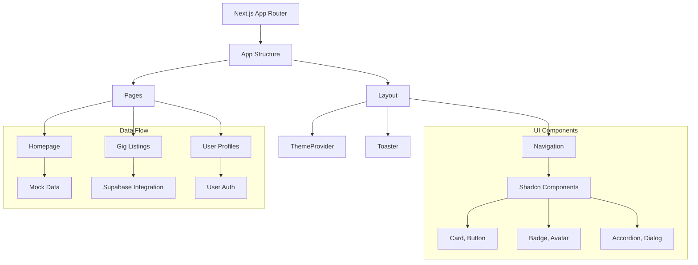

# 🎓 Student Marketplace - Project Analysis

## 📋 Project Overview

**Student Marketplace** is a revolutionary Next.js-based platform designed specifically for students in Pune, India, to connect, collaborate, and monetize their academic skills. This peer-to-peer marketplace enables students to offer services, find expert peers from local universities, and access job opportunities in a secure and user-friendly environment.

### 🎯 Key Objectives
- **Empower Students**: Provide a platform for students to monetize their skills
- **Local Networking**: Connect students within Pune's academic ecosystem
- **Skill Development**: Facilitate learning through peer-to-peer collaboration
- **Career Preparation**: Bridge the gap between academia and industry

## ⚙️ Technology Stack

### Frontend
- **Framework**: Next.js v15.5.4 (App Router)
- **Language**: TypeScript
- **UI Library**: React v19
- **Styling**: Tailwind CSS with `tailwind-merge` and `tailwindcss-animate`
- **Components**: shadcn/ui with Radix UI primitives
- **State Management**: React hooks and context API
- **Forms**: React Hook Form + Zod validation
- **Animations**: Framer Motion
- **Icons**: Lucide React

### Backend & Infrastructure
- **Database**: Supabase (PostgreSQL)
- **Authentication**: Supabase Auth (Email/Password)
- **Real-time Features**: Supabase Real-time subscriptions
- **Storage**: Supabase Storage
- **Payments**: Razorpay (Indian Payment Gateway)
- **Deployment**: Vercel

### Development Tools
- **Build Tools**: PostCSS, Autoprefixer
- **Testing**: Jest, React Testing Library
- **Linting**: ESLint, Prettier
- **Version Control**: Git

## 🏗️ Project Architecture



## 🏢 Detailed Architecture

### 1. Frontend Architecture
- **Framework**: Next.js 15.5.4 with App Router
- **Language**: TypeScript
- **UI Components**: shadcn/ui with Radix UI primitives
- **Styling**: Tailwind CSS with custom configurations
- **State Management**: React hooks and context API
- **Routing**: File-based routing in `app/` directory
- **Responsive Design**: Mobile-first approach with adaptive components

### 2. Backend Architecture
- **Database**: Supabase (PostgreSQL)
- **Authentication**: Supabase Auth with email/password
- **Real-time Features**: Supabase Real-time subscriptions
- **Storage**: Supabase Storage for file uploads
- **API Layer**: Next.js API routes in `app/api/`
- **Data Layer**: Custom data service abstraction in `lib/data-service.ts`

### 3. Core Features Implementation

#### 👥 User Roles & Onboarding
The platform supports three distinct user roles:
1. **Students/Freelancers**: Offer services and earn money
2. **Clients/Employers**: Hire students for projects
3. **Placement Officers/Faculty**: Track student performance

The onboarding flow in `app/onboarding/page.tsx` guides users through role selection and profile setup.

#### 🛍️ Service Marketplace
- **Gigs System**: Students create service listings (gigs) in `app/create-gig/`
- **Categories**: Services organized by categories from Supabase
- **Search & Filters**: Advanced search in `app/gigs/page.tsx`
- **Service Packages**: Multiple pricing tiers for services

#### 💼 Job Board
- **Job Listings**: Clients post job opportunities
- **Applications**: Students apply to jobs with proposals
- **Assignments**: Workflow for job execution and milestone tracking

#### 💬 Communication System
- **Real-time Messaging**: WebSocket-based chat in `app/messages/page.tsx`
- **Presence Detection**: Online/offline status indicators
- **Typing Indicators**: Real-time typing notifications
- **File Attachments**: Image and document sharing
- **Context-aware Chat**: Job/service-specific conversations

#### 💰 Payment Processing
- **Razorpay Integration**: Indian payment gateway for transactions
- **Milestone Payments**: Release payments upon milestone completion
- **Wallet System**: User balance tracking
- **Escrow Mechanism**: Secure payment handling

#### ⭐ Reputation System
- **Reviews & Ratings**: Client feedback on completed services
- **Reputation Score**: Algorithmic trust scoring
- **Verification Badges**: Verified user indicators

### 4. Data Model
The Supabase database contains the following key tables:
- **users**: User profiles with roles, colleges, and skills
- **gigs**: Service listings with pricing and categories
- **services**: Alternative service model with packages
- **jobs**: Job postings with deadlines and requirements
- **orders**: Service purchase transactions
- **applications**: Job applications with proposals
- **assignments**: Job execution with milestones
- **payments**: Payment records with statuses
- **reviews**: User feedback and ratings
- **conversations**: Chat threads between users
- **messages**: Individual chat messages
- **categories**: Service/job category definitions

### 5. Security & Authentication
- **Role-based Access Control**: Different permissions per user type
- **Session Management**: Supabase Auth with secure tokens
- **Data Protection**: Row Level Security (RLS) in Supabase
- **Input Validation**: Zod schema validation
- **Environment Variables**: Secure API key storage

### 6. Performance & Optimization
- **Static Site Generation**: Pre-rendering for faster loads
- **Code Splitting**: Dynamic imports for reduced bundle size
- **Image Optimization**: Responsive images with lazy loading
- **Caching**: Database query caching
- **Real-time Updates**: WebSocket connections for instant updates

## 🛠️ Development Workflow

### Local Development
1. Install dependencies: `npm install`
2. Set up environment variables in `.env.local`
3. Run development server: `npm run dev`
4. Access at http://localhost:3000

### Environment Variables Required
- `NEXT_PUBLIC_SUPABASE_URL`: Supabase project URL
- `NEXT_PUBLIC_SUPABASE_ANON_KEY`: Supabase anonymous key
- `SUPABASE_SERVICE_ROLE_KEY`: Supabase service role key
- `NEXT_PUBLIC_RAZORPAY_KEY_ID`: Razorpay public key
- `RAZORPAY_KEY_SECRET`: Razorpay secret key

### Deployment
- **Platform**: Vercel (optimized for Next.js)
- **Database**: Supabase PostgreSQL
- **Static Assets**: Unoptimized image handling
- **Environment**: Production-ready configuration

## 🧩 Key Components

### UI Components
Located in `components/` directory:
- **Navigation**: Responsive navbar with role-based actions
- **Gig Cards**: Service listing components
- **Category Cards**: Category browsing UI
- **Chat Interface**: Real-time messaging system
- **Payment Buttons**: Razorpay integration components
- **Form Elements**: Custom input components

### Core Libraries
- **Supabase Client**: Database, auth, and real-time operations
- **React Hook Form**: Form handling and validation
- **Zod**: Schema validation
- **Framer Motion**: Animations and transitions
- **Lucide React**: Icon library
- **Recharts**: Data visualization
- **Tailwind CSS**: Utility-first styling

### Real-time Chat System
- **Supabase Real-time**: WebSocket connections for instant messaging
- **Presence Detection**: Online/offline status using Supabase presence channels
- **Typing Indicators**: Real-time typing notifications via broadcast channels
- **File Attachments**: Image and document sharing through Supabase Storage

### How Chat Tools Work Together

#### 1. Supabase Real-time Subscriptions
The chat system uses Supabase's real-time capabilities to create persistent WebSocket connections:
- **Message Delivery**: New messages are instantly delivered to all participants
- **Presence Channels**: Track online/offline status of users
- **Broadcast Channels**: Send typing indicators and other ephemeral notifications

#### 2. Data Service Layer
The `dataService` abstraction in `lib/data-service.ts` handles all chat-related operations:
- **Conversation Management**: Create and retrieve conversation threads
- **Message Handling**: Send, receive, and track message status
- **Presence Tracking**: Monitor user online status
- **File Uploads**: Handle attachment storage and retrieval

#### 3. UI Components
The chat interface is built with specialized components:
- **Message Display**: Real-time rendering of messages with status indicators
- **Typing Indicators**: Visual feedback when other users are typing
- **Presence Badges**: Online status indicators
- **File Attachments**: Preview and download functionality

#### 4. State Management
React hooks manage the chat state efficiently:
- **Conversation State**: Track active conversations and their metadata
- **Message History**: Maintain message lists with pagination
- **Real-time Updates**: Handle incoming messages without page refresh
- **Presence State**: Update user online status in real-time

### Payment System
The platform implements a secure payment system for service transactions:

#### 1. Razorpay Integration
- **Payment Gateway**: Indian payment processor for secure transactions
- **Milestone Payments**: Release payments upon completion of work milestones
- **Escrow System**: Secure holding of funds until service delivery

#### 2. Wallet Management
- **User Balances**: Track earnings and spending in user wallets
- **Transaction History**: Record all payment activities
- **Payout Processing**: Handle withdrawals to user bank accounts

#### 3. Data Service Integration
The `dataService` handles payment-related operations:
- **Order Creation**: Initialize payment workflows
- **Transaction Tracking**: Monitor payment status changes
- **Balance Updates**: Adjust wallet balances after transactions

## 📁 Project Structure
```
student-marketplace/
├── app/                 # Next.js app router pages
│   ├── api/             # API routes
│   ├── gigs/            # Service marketplace
│   ├── jobs/            # Job board
│   ├── messages/        # Chat system
│   ├── dashboard/       # User dashboards
│   ├── profile/         # User profiles
│   └── ...
├── components/          # UI components
├── lib/                 # Business logic
├── public/              # Static assets
└── styles/              # Global styles
```

## 🎯 Future Enhancements

### Short-term Goals
- [ ] Mobile app development (React Native)
- [ ] Advanced search and filtering options
- [ ] Notification system improvements
- [ ] Multi-language support

### Long-term Vision
- [ ] AI-powered skill matching
- [ ] Integration with university systems
- [ ] Virtual internship opportunities
- [ ] Community forums and discussion boards

## 📝 Conclusion

The Student Marketplace is a comprehensive platform that connects students with clients for various services and job opportunities. Built with modern web technologies, it provides a robust foundation for a peer-to-peer marketplace with real-time communication, secure payments, and a user-friendly interface.

The architecture leverages Next.js for server-side rendering and optimal performance, Supabase for backend services including real-time database and authentication, and Razorpay for secure payment processing. The component-based design using shadcn/ui and Radix UI ensures a consistent and accessible user experience across all device types.

With its modular structure and well-defined data models, the platform can be easily extended with additional features while maintaining code quality and performance standards.
